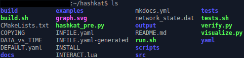

[hashkat.org](http://hashkat.org)

July 2015 - This site is currently under construction. Please return regularly over the course of the summer for further updates. 

# The *hashkat* Directory

The following gives a brief summary of every file and directory that you will immediately find in the #k@ directory.

  

## benchmarks

Contains several input files used in the testing and development of #k@.

## build

## build.sh

Script that builds and runs #k@. Typing in the command

`./build.sh -O --build`

will build #k@ without running it.

## CMakeLists.txt

## COPYING

Contains the GNU General Public License, Version 3, 29 June, 2007..

## DATA_vs_TIME

File created when running a network simulation. Details the length of simulated time that has occurred in simulated minutes, the number of agents that are present, the number of follows, tweets, retweets, and unfollows that have occurred, the cumulative rate function, and the length of real time that had passed in seconds at various points in the network simulation.

## DEFAULT.yaml

## docs

Contains the pages and images used in the write-up of the #k@ documentation.

## examples

Contains a list of directories, each with there own **INFILE.yaml** that can be used as an example of a particular network simulation.

## hashkat_pre.py

## INFILE.yaml

## INFILE.yaml-generated

File generated when *build.sh* or *run.sh* is run. Used in the running of network simulations, it is always replaced with an updated version when a new network simulation is being run.

## INSTALL

Contains instructions on how to install #k@ on Linux and Mac OS X.

## INTERACT.lua

Used when running interactive mode in #k@. Details what is done when making certain commands.

## mkdocs.yml

File used to organize the documentation of #k@.

## network_state.dat

Save file in which your network simulation information will be saved to if *save_network_on_timeout* is enabled. If a network simulation is paused midway through, it can only be continued if *load_network_on_startup* is enabled, in which case the simulation will look for this file to load the existing network information. 

## output

## README.md

Summary of what can be found in the *hashkat* directory.

## run.sh

Script that runs the #k@ program.

## SAMPLE_INTERACT.lua

## scripts

## src

Contains the #k@ source code.

## tests

Contains several basic tests used in the development of #k@. Its subdirectory *referencefiles* contains the various input files that are tested when running *tests.sh*.

## tests.sh

Script that runs *verify.py* on every single reference network simulation in *tests/referencefiles/*. Used in the development of #k@ to confirm if any changes made to the source code did or did not affect impact the output of a netowkr simulation.

## tutorials

Contains a directory corresponding to almost every tutorial found in the #k@ documentation. Each tutorial directory contains an INFILE.yaml file that will be created during its respective tutorial.

## verify.py

Script run in *tests.sh* to compare the data of output files in a network simulation to what is expected. If there is discrepancy between an output file and its reference, the file name is printed to the screen. Used in the development of #k@ to confirm if any changes made to the source code did or did not affect impact the output of a netowkr simulation.   

## yaml
